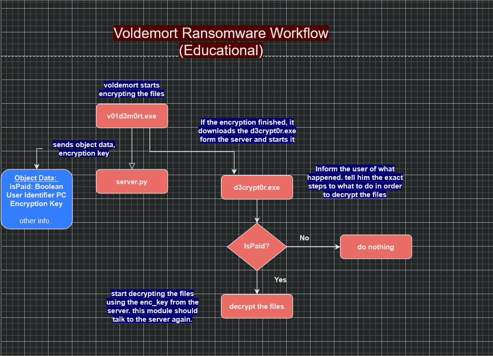
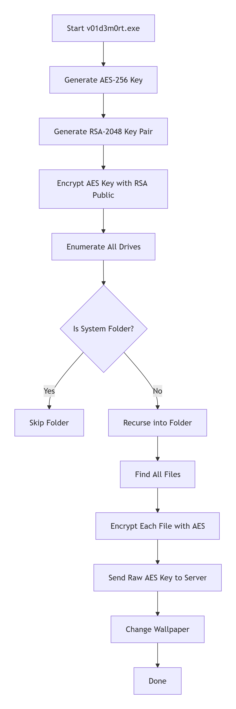
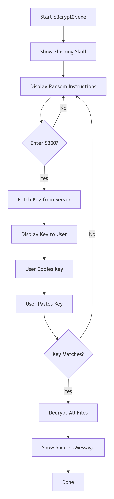
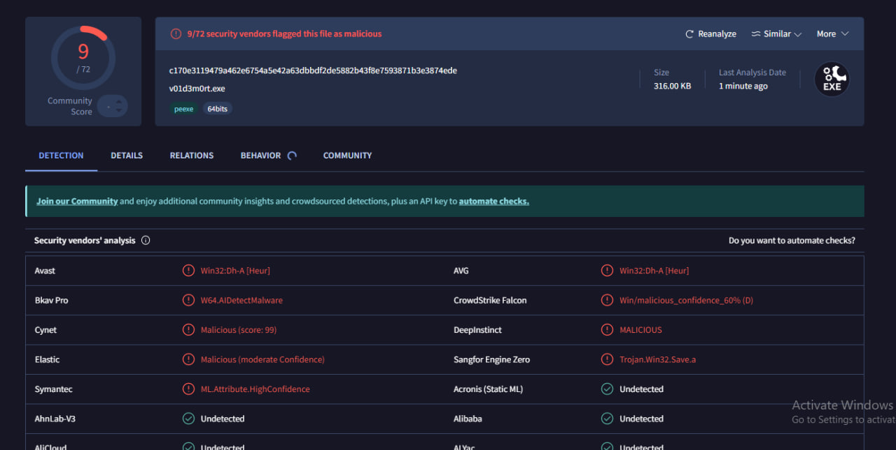

# Voldemort Ransomware (Educational Project)

A fully functional **ransomware simulation** built in C++ for **educational purposes only**. This project demonstrates the complete lifecycle of ransomware: file encryption, C2 communication, payment simulation, and decryption.

**Don't run it on your computer. Use VM.**

## Workflow:

### Windows VM (Victim)
- Windows 10/11 VM
- Visual Studio 2022+ with C++ tools
- Windows SDK
- 4GB+ RAM recommended

### Ubuntu VM (C2 Server)
- Ubuntu 20.04+ VM
- Python 3.8+
- Network connectivity with Windows VM

### This figure shows the flow diagram of the malware


### compile v01d3m0rt.cpp (encryptor) & d3crypt0r.cpp (decryptor)
```bash
cl /EHsc v01d3m0rt.cpp AES.cpp RSA.cpp Victim.cpp /Fe:v01d3m0rt.exe
cl /EHsc d3crypt0r.cpp AES.cpp RSA.cpp Victim.cpp /Fe:d3crypt0r.exe
```

### Encryptor details


### Decryptor details


#### Decryptor UI before the ransom note (Petya style) ;)


### Interesting catches from VirusTotal for the encryptor and decryptor



### Notes:
#### 1. There are still some issues in the malware development, like the encrpytion & decryption logic. Also, the long time of encryption should be in consideration. 
#### 2. The decryptor should be downloaded from the server as explained in the flow diagram. But for simplicity i skipped this step and assume that it will be already in the victim side.
